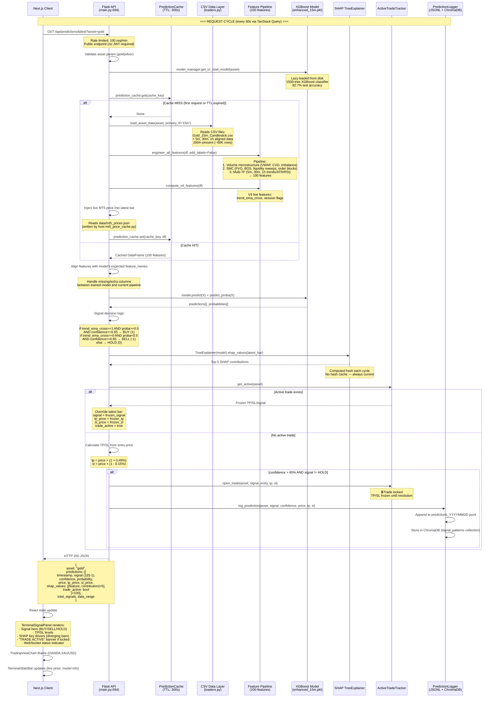
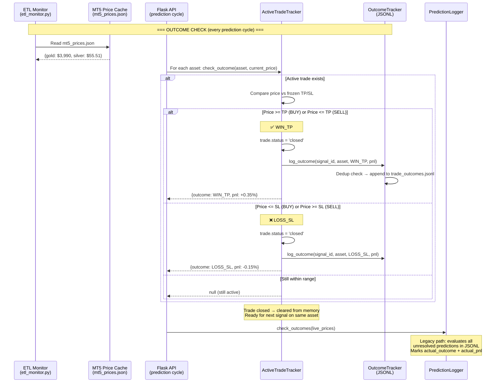
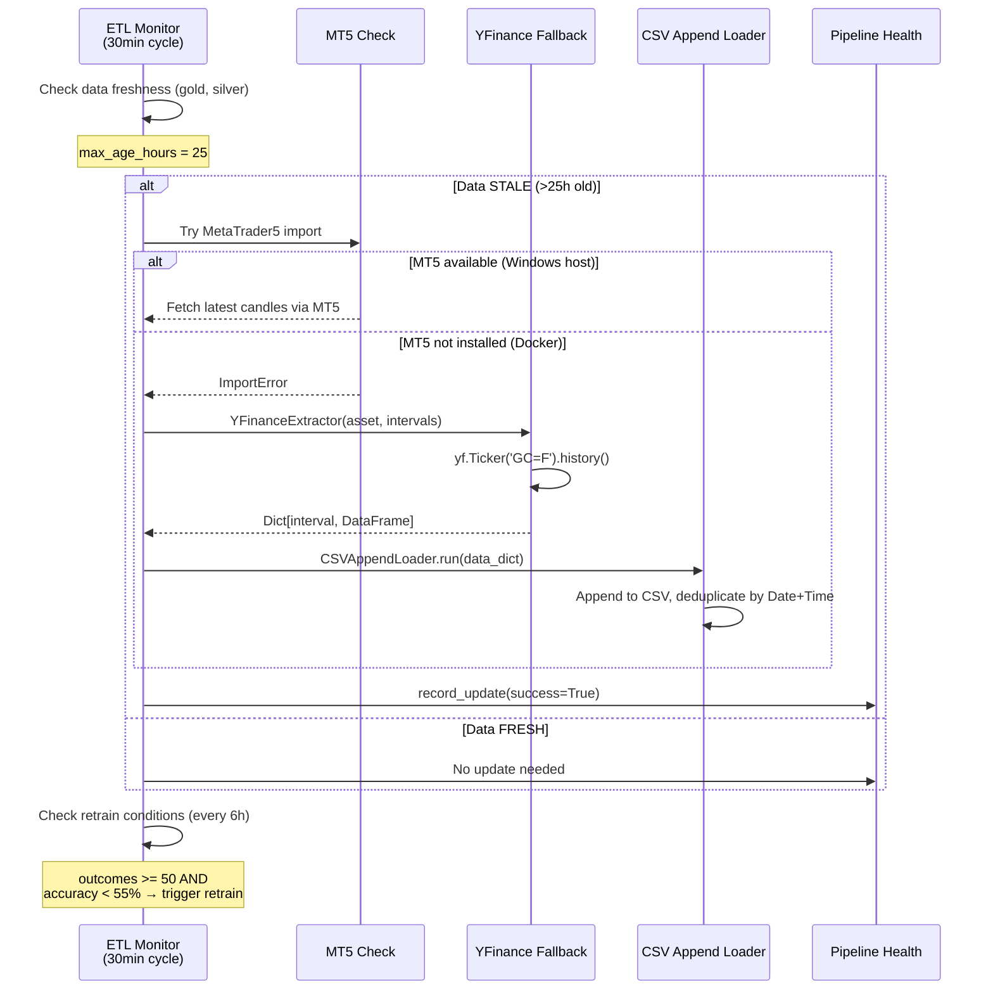

# MetalMind SMCForge — Interaction Sequence Diagram

## Prediction Flow (GET /api/predictions/latest)

---

## Active Trade Resolution Flow

---

## ETL Pipeline Flow (Background)

---

## Key Architecture Notes

| Component | Technology | Details |
|-----------|-----------|---------|
| **API** | Flask 3.0 + SocketIO | Port 5000, CORS enabled, rate limited |
| **ML Model** | XGBoost 2.0 | 1500 trees, max_depth=5, Optuna-tuned |
| **Features** | 100 engineered | Volume (VWAP, CVD), SMC (FVG, BOS, OB), Multi-TF (5m/30m/1h), V4 (trend) |
| **Data** | CSV files | 2004–present, 15m primary, 4 timeframes aligned |
| **Explainability** | SHAP TreeExplainer | Top 5 features per prediction, computed on-demand |
| **Live Prices** | MT5 cache file | Written by host machine, read by Docker container |
| **Prediction Storage** | JSONL + ChromaDB | Daily files + vector similarity search |
| **User Data** | PostgreSQL 15 | Auth, profiles, watchlists |
| **Active Trades** | In-memory tracker | One trade per asset, frozen TP/SL until resolution |
| **Outcome Tracking** | OutcomeTracker | Deduplicated JSONL, signal_id based |
| **Frontend** | Next.js 16 + React 19 | Bloomberg Terminal aesthetic, TradingView charts |
