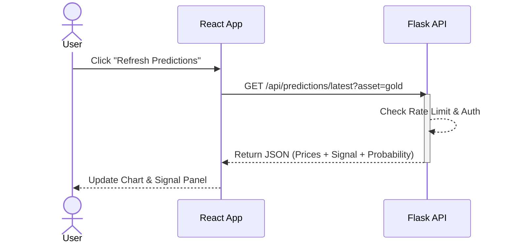
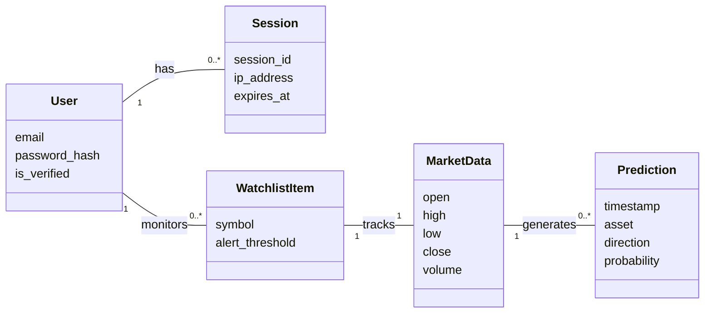
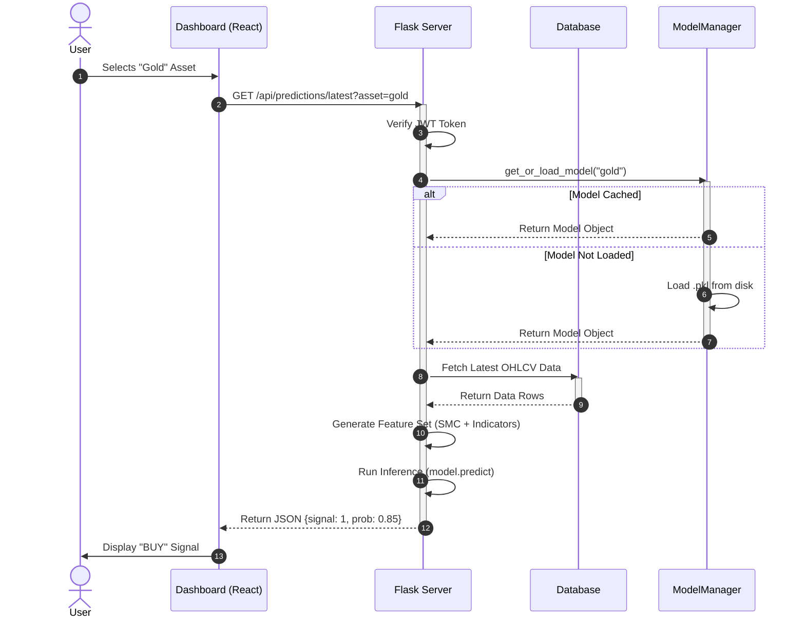
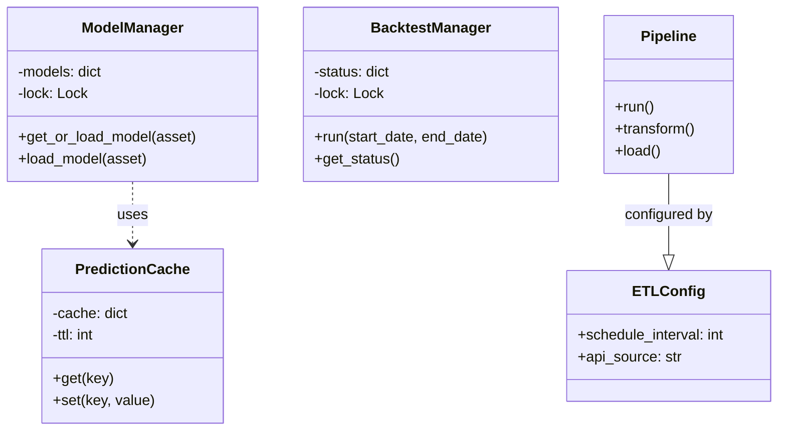
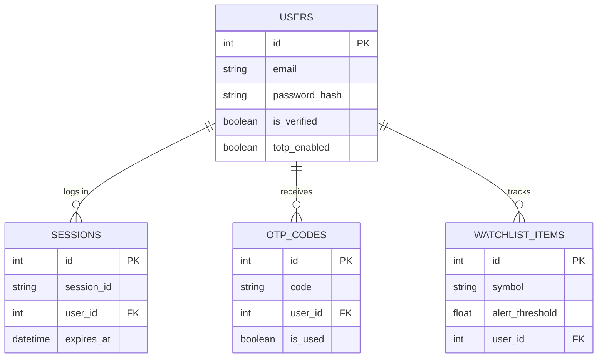

# FYP Report Diagrams

This document contains the source code for all required diagrams in Mermaid.js format. You can render these using any Markdown editor that supports Mermaid (like VS Code, Obsidian, or GitHub) or use an online live editor (https://mermaid.live).

## Chapter 3: Use Case Diagram

```mermaid
usecaseDiagram
    actor "Guest User" as Guest
    actor "Registered User" as User
    actor "Admin" as Admin
    actor "System Timer" as Timer

    package "MetalMind SMCForge" {
        usecase "Register" as UC1
        usecase "Login" as UC2
        usecase "View Dashboard" as UC3
        usecase "View Market Prediction" as UC4
        usecase "View SMC Overlays" as UC5
        usecase "Run Backtest" as UC6
        usecase "Manage User Profile" as UC7
        usecase "Trigger ETL Pipeline" as UC8
        usecase "Manage System Config" as UC9
    }

    Guest --> UC1
    Guest --> UC2
    
    User --> UC2
    User --> UC3
    User --> UC4
    User --> UC5
    User --> UC6
    User --> UC7
    
    Admin --> UC8
    Admin --> UC9
    Admin --> UC6
    
    Timer --> UC8
```

## Chapter 3: System Sequence Diagram (Get Prediction)



## Chapter 3: Domain Model



## Chapter 4: System Architecture Diagram

```mermaid
graph TD
    subgraph Client_Side [Client Side]
        Browser[Web Browser]
        React[React Application]
    end

    subgraph Server_Side [Server Side]
        API[Flask REST API]
        Auth[Auth Service]
        ETL[ETL Pipeline]
        ModelMgr[Model Manager]
    end

    subgraph Data_Layer [Data Layer]
        DB[(SQLite/Postgres)]
        Models[ML Models (.pkl)]
        Cache[File Cache]
    end

    subgraph External [External Services]
        YF[Yahoo Finance API]
    end

    Browser -->|HTTP/WebSocket| React
    React -->|JSON Requests| API
    
    API --> Auth
    API --> ModelMgr
    API --> DB
    
    ModelMgr --> Models
    ModelMgr --> Cache
    
    ETL -->|Schedule| YF
    ETL -->|Store| DB
    ETL -->|Update| Cache
```

## Chapter 4: Interaction (Sequence) Diagram - detailed



## Chapter 4: Class Diagram (Backend)



## Chapter 4: Entity Relationship Diagram (ERD)



## Chapter 4: Activity Diagram (ETL Process)

```mermaid
flowchart TD
    Start((Start)) --> Trigger[Timer Trigger (15m)]
    Trigger --> FetchData[Fetch Data from API]
    
    FetchData --> CheckErrors{Data Valid?}
    CheckErrors -- No --> LogError[Log Error] --> End((Stop))
    CheckErrors -- Yes --> Process[Process OHLCV]
    
    Process --> CalcInd[Calculate Generic Indicators]
    CalcInd --> CalcSMC[Calculate SMC Features]
    CalcSMC --> Engineer[Engineer ML Features]
    
    Engineer --> Store[Store in Database]
    Store --> LoadModel[Load XGBoost Model]
    LoadModel --> Predict[Generate Prediction]
    
    Predict --> Cache[Update JSON Cache]
    Cache --> Notify[Notify WebSocket Clients]
    Notify --> End
```
